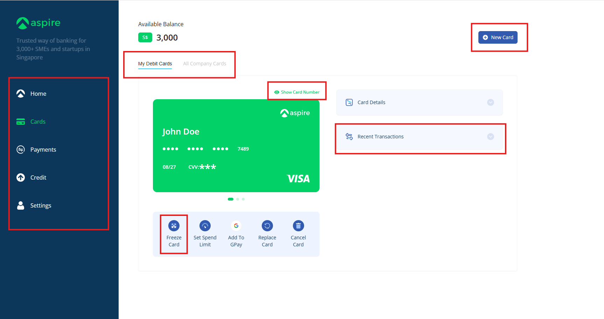

# 💳 Take Home Test from Aspire

## 🚀 Features

- Fully functional side menu with navigation across multiple pages.
- Tabs are interactive and fully operational.
- Show/hide card number feature is implemented.
- Cards are displayed in a swipeable carousel.
- Responsive design, optimized for both mobile and desktop screens.
- Users can add a new card by entering the cardholder name; the system automatically generates a random card number and expiration date.
- The input form includes validation powered by react-hook-form.
- Newly created cards are dynamically added to the carousel alongside existing ones.
- Cards can be frozen or unfrozen via confirmation modals. Frozen cards appear greyed out for visual distinction.

## Note: Minor UI alignment adjustments were made based on personal design preference.

## 🧱 Tech Stack




- Vite React.js
- Tailwind CSS
- TypeScript
- Redux Toolkit
- React Hook Form

## 📦 Installation

```bash
git clone https://github.com/karthik-padav/Aspire.git
cd Aspire
npm install
npm run dev
```
